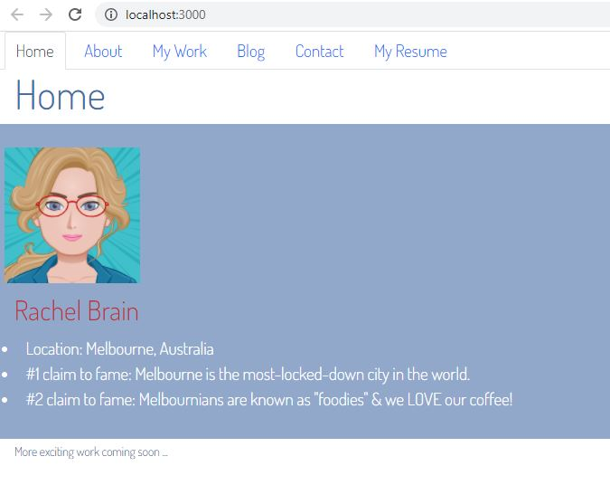

# Portfolio of Rachel Brain on REACT
My portfolio built with REACT and REACT-BOOTSTRAP showcasing my recent Coding work.

[](https://opensource.org/licenses/MIT)


## User Story

```
AS A upcoming web developer
I WANT to showcase my portfolio of deployed work samples using REACT (the latest technology!)
SO THAT I can present the best examples of my work so a potential employer can assess whether I am a good candidate for a position they have available
```

## Description
My motivation for undertaking this project was to update my portfolio with recent web development work using REACT.  It is to use as an adjunct to my resume, giving me the ability to present the best examples of my coding work.

## Installation
Open the URL of the deployed application at: https://rachel-brain.github.io/portfolio-of-rachel-brain-on-react 

## Usage
Click on the images to be directed to examples of my deployed work & on the github links to be transferred to my repositories.

## Projects featured
### Title: Arty Pants group project
* Alternative title: creating-art
* Team members: Afsha Amber, Rachel Brain, Jesse De Jong, Chandler Liang

### Title: Wizard Wipeout! group project
* Alternative title: super-duper-bassoon
* Team members: Mustafa Abdelrahman, Rachel Brain, Suva Pokharel & David Szamek

### Title: Weather Dashboard
* Alternative title: city-weather-dashboard

### Title: Gotta Keep 'em Generated
* Alternative title: generate-passwords

### Title: Workday Scheduler
* Alternative title: handy-workday-scheduler

### Title: Note-Taker App
* Alternative title: handy-note-taker

## Screenshot of home page
.

## URLs
* The URL of the deployed application:  
* The URL of the GitHub repository:     https://github.com/rachel-brain/portfolio-of-rachel-brain-on-react

* Links to all URLs for the featured projects' deployed websites and GitHub repositories are included in the portfolio.

## Contact Me
* Mobile: +61 432 297 755
* Email: rachel.brain@internode.on.net
* LinkedIn: https://www.linkedin.com/in/rachel-brain-89570930
* GitHub: https://github.com/rachel-brain